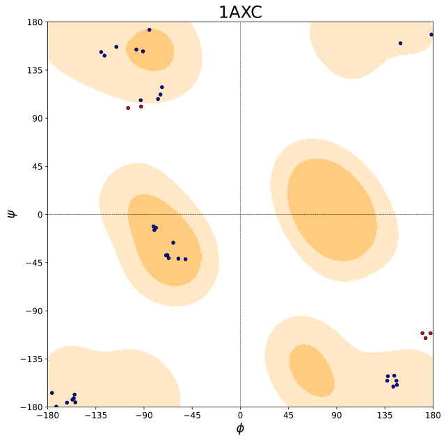

# Ramachandran

Ramachandran plot visualizes energetically allowed regions for backbone torsion (dihedral) angles ψ against φ of amino acid residues in protein structure. This Python package provides the implementations from scratch to crawling PDB/PDBx files from RCSB PDB Bank, parsing PDB/PDBx files for extracting geometric information, computing the torsion angles of residues from atom coordinates, analyzing the Ramachandran favorable regions from the reference PDB/PDBx files selected, and creating Ramachandran plots for user-provided PDB/PDBx files.

## Dependencies

* Python 3.8+
* Numpy 1.20.1+
* Scipy 1.6.0+
* Matplotlib 3.3.4+

## Usages

It is recommended to use Docker container to run the program.

### Build Docker Image

```
$ docker build -f docker/ramachandran.Dockerfile --no-cache --tag=ramachandran:0.0.1 .
```

### Run Docker Container

```
$ docker run -it --rm --gpus device=0 -v $(pwd):/mnt ramachandran:0.0.1
```

### Install

```
$ pip install ramachandran
```

### Create Ramachandran Plots

```
$ ramachandran-plot --help
usage: ramachandran-plot [-h] --file-path FILE_PATH
                         [--save-dir-path SAVE_DIR_PATH]
                         [--protein-name PROTEIN_NAME]

Ramachandran Plot Tool. Plots for GLY, PRO, pre-PRO, and Other residues will
be created.

optional arguments:
  -h, --help            show this help message and exit
  --file-path FILE_PATH
                        PDB/PDBx file path. (default: None)
  --save-dir-path SAVE_DIR_PATH
                        Directory path for saving the Ramachandran plots for
                        the PDB/PDBx file. (default: .)
  --protein-name PROTEIN_NAME
                        Protein name. (default: None)
```

## Demo

```
$ ramachandran_plot --file-path 1AXC.cif --save-dir-path 1AXC --protein-name 1AXC
```

|              General             |              GLY             |              PRO             |             Pre-PRO             |
|:--------------------------------:|:----------------------------:|:----------------------------:|:-------------------------------:|
|  |  |  |  |

## TODO

- [ ] Filter homologous proteins for computing the Ramachandran statistics, since too many homologous protein structures will bias the statistics.
- [ ] Add the [original hard-coded Ramachandran favorable region](https://pubmed.ncbi.nlm.nih.gov/4882249/).

## References

* [Ramachandran Plot](https://en.wikipedia.org/wiki/Ramachandran_plot)
* [PyRAMA](https://github.com/gerdos/PyRAMA)
